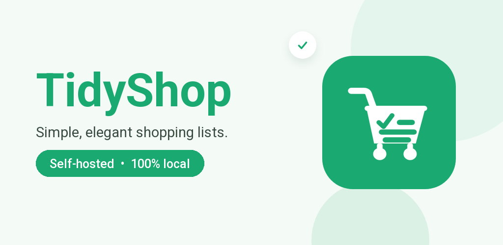

[](https://github.com/jimz011/tidyshop-connector/pkgs/container/tidyshop-connector)
[](https://github.com/jimz011/tidyshop-connector/releases)
[](LICENSE)

[](https://www.buymeacoffee.com/w8Jnf6Hit)
[](https://paypal.me/JimmySchings)

# TidyShop Connector



<p align="center">
  <a href="https://play.google.com/store/apps/details?id=com.jimz011apps.tidyshop">
    
  </a>
</p>

The self-hosted family sharing server for [TidyShop](https://play.google.com/store/apps/details?id=com.jimz011apps.tidyshop),
the shopping-list app for Android.

**📖 [Documentation](https://jimz011.github.io/tidyshop-connector/)** — installation with
[Docker](https://jimz011.github.io/tidyshop-connector/getting-started/docker/) or on
[Unraid](https://jimz011.github.io/tidyshop-connector/getting-started/unraid/),
[reverse proxy setup](https://jimz011.github.io/tidyshop-connector/getting-started/reverse-proxy/),
[FAQ](https://jimz011.github.io/tidyshop-connector/faq/) and
[troubleshooting](https://jimz011.github.io/tidyshop-connector/troubleshooting/).

TidyShop works entirely on your phone. The connector is what you add when the rest of the household
should be on the same lists: one small container on your own server, holding your family's shared
lists in a single file. No TidyShop cloud, no account with the developer, nothing that phones home.

## Features

- **Live shared lists** — changes reach every open phone within a second, over Server-Sent Events,
  with a full snapshot on every reconnect
- **Per-list permissions** — share each list as *View*, *Check* (tick off, nothing else) or
  *Edit*, per person or with the whole household
- **No passwords** — every phone enrols a hardware-backed EC P-256 key; the connector stores only
  the public half and verifies a short-lived signed assertion on each request
- **Invites by QR code** — single-use, expiring invites and device link codes; the master pairing
  key never has to leave the administrator
- **Recovery** — one-time recovery codes, owner-issued link codes, or the pairing key bring a
  reinstalled phone back to the identity it had, rather than making it a new person
- **Optional single sign-on** — Authentik or any OIDC provider, alongside device keys, never
  instead of them
- **Member backups** — each member keeps their 14 most recent TidyShop backups on the server
- **Small and boring** — one static Go binary using only the standard library, one JSON file for
  state, images for `amd64` and `arm64`

## Quick start

### Docker Compose

```yaml
services:
  tidyshop-connector:
    image: ghcr.io/jimz011/tidyshop-connector:latest
    container_name: TidyShop-Connector
    restart: unless-stopped
    environment:
      PAIRING_KEY_FILE: /data/pairing-key.txt
    volumes:
      - ./data:/data
    ports:
      - "127.0.0.1:8787:8787"
```

```bash
mkdir -p data && openssl rand -hex 24 > data/pairing-key.txt
docker compose up -d
```

Then put it behind a reverse proxy with HTTPS — the app does not accept plain-HTTP servers. The
[full guide](https://jimz011.github.io/tidyshop-connector/getting-started/docker/) covers proxy
networks, Caddy, Nginx, Nginx Proxy Manager, SWAG, Traefik and Cloudflare Tunnel.

### Unraid

Once it is listed in Community Applications, search for **TidyShop** in the **Apps** tab. Until then, add the template by hand:

```bash
wget -O /boot/config/plugins/dockerMan/templates-user/my-TidyShop-Connector.xml \
  https://raw.githubusercontent.com/jimz011/tidyshop-connector/main/unraid/tidyshop-connector.xml
```

then **Docker → Add Container → Template: TidyShop-Connector**. See the
[Unraid guide](https://jimz011.github.io/tidyshop-connector/getting-started/unraid/).

### Connect the app

In TidyShop, open **Settings → Family sharing → Pair with a family server**, enter
`https://<your-hostname>` and the pairing key. The first phone to pair becomes the family owner and
invites everyone else with a QR code.

## Configuration

| Variable | Default | Description |
| --- | --- | --- |
| `PAIRING_KEY` | — | Master pairing key, 12+ characters. Takes precedence over the file. |
| `PAIRING_KEY_FILE` | — | File holding the pairing key. |
| `DATA_FILE` | `/data/state.json` | State file. |
| `PORT` | `8787` | Listen port. |
| `OIDC_ISSUER` | — | Enables single sign-on. Unset: device keys only. |
| `OIDC_AUDIENCE` | `tidyshop-android` | Required token audience when SSO is on. |
| `ICON_FILE` | `/data/icon.png` | Optional image served at `/icon.png`. |

## Requirements

- Docker, or Unraid
- A hostname and a reverse proxy with a valid HTTPS certificate
- [TidyShop](https://play.google.com/store/apps/details?id=com.jimz011apps.tidyshop) on each phone

## Building

```bash
go test ./...
docker build -t tidyshop-connector .
```

The Dockerfile runs the tests before compiling, so a broken checkout fails to build. Tagging a
release `vX.Y.Z` publishes `ghcr.io/jimz011/tidyshop-connector` with `X.Y.Z`, `X.Y`, `X` and
`latest` tags; every push to `main` publishes `edge`.

## Documentation

The docs site is [MkDocs](https://www.mkdocs.org/) with
[Material for MkDocs](https://squidfunk.github.io/mkdocs-material/); sources live in `docs/` and
`mkdocs.yml`. Pushing to `main` publishes it to GitHub Pages. To work on it locally:

```
pip install -r docs/requirements.txt
mkdocs serve
```

## Security

Found a vulnerability? Please email jimz011apps@gmail.com rather than opening a public issue.
Never post your pairing key, recovery codes or `state.json` in an issue.

## License

[Mozilla Public License 2.0](LICENSE).

## Other Information

This project was created with help of AI like Claude and OpenAI. If you dislike AI being used in
projects, then do not install this!
